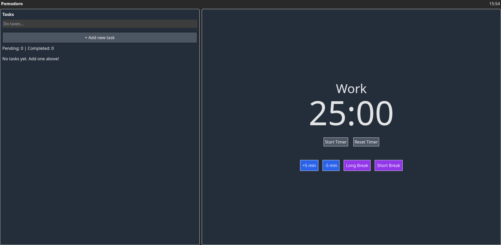

# 🍅 Pomodoro Focus Timer - Boost Your Productivity

A clean, modern, and responsive Pomodoro Timer web application built with HTML, CSS (TailWind), and React (JavaScript). This tool helps you implement the Pomodoro Technique to boost productivity and maintain focus.

✨ Features:

⏱️ Standart Pomodoro Timer: Standart focus (pomodoro) and break intervals.

🔄 Easy Session Switching: Button switches allow for quick switching between focus and breaks.

📱 Responsive Design: Works seamlessly on desktop, tablet, and mobile devices.

🎨 Clean & Minimal UI: A distraction-free interface to help you stay focused on your task.

⏸️ Play/Pause & Reset: Full control over your timer with play, pause, and reset functionality.

📋 Task List: See all your pending and completed tasks in one place

➕ Add Tasks: Quickly create new tasks for your focus sessions

🗑️ Remove Tasks: Delete tasks you no longer need

✅ Mark Complete: Check off finished tasks with satisfying feedback

🚀 Live Demo
Check out the live application here: [\[Live Demo Link\]](https://kris-programmer.github.io/pomodoro-web-app/)
